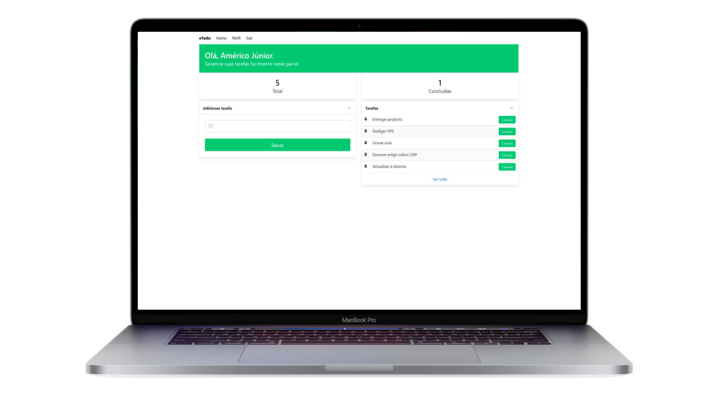

# eTasks

# :pushpin: índice

- [eTasks](#etasks)
- [:pushpin: índice](#pushpin-índice)
  - [:dart: Objetivo do Projeto](#dart-objetivo-do-projeto)
  - [:rocket: Tecnologias Utilizadas](#rocket-tecnologias-utilizadas)
  - [:gear: Requisitos](#gear-requisitos)
  - [:arrow_forward: Rodar o Projeto](#arrow_forward-rodar-o-projeto)
  - [:man_technologist: Redes Sociais](#man_technologist-redes-sociais)
  - [:man_technologist: Outras informações](#man_technologist-outras-informações)
  - [* GitHub](#-github)

---

## :dart: Objetivo do Projeto

Uma plataforma web que gerencia tarefas, e ela foi criada com vulnerabilidades propositádas para que os estudantes da The Bug Hunter possam praticar o que estão aprendendo.

## :rocket: Tecnologias Utilizadas

* [Python3](https://www.python.org/)
* [Flask SQLAlchemy](https://pypi.org/project/Flask-SQLAlchemy/)
* **Banco de dados:** [SQLite](https://www.sqlite.org/index.html)
* **Framework Python:** [Flask](https://palletsprojects.com/p/flask/)
* **Framework CSS:** [Bulma CSS](https://bulma.io/)

**Dependências**

* flask
* flask_sqlalchemy
* flask_login

## :gear: Requisitos

* [Git](https://git-scm.com/) (Para clonar, opcional)
* [Python3](https://www.python.org/)
* [Pip3]()

## :arrow_forward: Rodar o Projeto

* Primeiro passo, clone ou baixe o projeto em sua maquina
* Abra a pasta do projeto no terminal
* Instale o virtualenv com o comando `pip install virtualenv` 
* Crie virtualvenv com o comando `python3 -m venv venv`
* Ative o virtualvenv com o comando `. venv/bin/activate`
* Instale os requisitos com o comando `pip install -r requirements.txt`
* Configure as variáveis ambiente com os comandos:
* * `export FLASK_APP=app.py`
* * `export FLASK_RUN_PORT=80`
* * `export FLASK_RUN_HOST="0.0.0.0"`
* Inicie o servidor com o comando `flask run` 
* A aplicação estara disponível na porta: **5000**

## :man_technologist: Redes Sociais

* [instagram](https://www.instagram.com/americosmjr/)
* [Linkedin](https://www.linkedin.com/in/americo-junior/)

## :man_technologist: Outras informações
* [GitHub](https://github.com/americo)
---

<h5 align='center' >Feito com :purple_heart: por <a href="https://americojunior.com" target="_blank">Américo Júnior</a> </h5>
